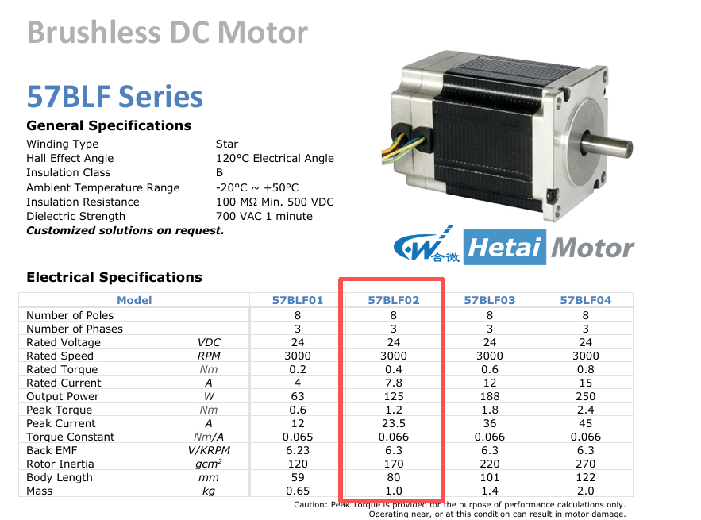

# S2 力学与电机层 — 实施方案（57BLF02 冻结版）

> 文档性质：S2 当前执行版本的任务路线图与交付标准。
> 当前基线：以 [00_frozen/params.md](00_frozen/params.md) 和 [04_simulink/init_params.m](04_simulink/init_params.m) 为唯一执行口径。
> 当前电机：57BLF02，24V/125W/3000rpm，48V 母线通过 PWM 降压使用。
> 最后更新：2026-04-18 by S2

---

## 一、当前冻结结论

### 1.1 当前方案已冻结的核心事实

S2 后续工作不再围绕 42BLF02 展开，而是统一切换到 57BLF02 方案。

| 类别         | 冻结值      | 依据                                           |
| ------------ | ----------- | ---------------------------------------------- |
| 电机型号     | 57BLF02     | `params.md` 已冻结，`init_params.m` 已同步 |
| 额定电压     | 24 V        | Hetai 57BLF02 系列图 + 冻结参数                |
| 母线电压     | 48 V        | 题设固定，采用 PWM 降压                        |
| 额定功率     | 125 W       | 冻结参数                                       |
| 额定转速     | 3000 rpm    | 冻结参数                                       |
| 减速比       | 12.5:1      | `3000/240=12.5`                              |
| 峰值力矩需求 | 0.4414 N·m | 已在 `params.md` 固化                        |
| 电机峰值力矩 | 1.20 N·m   | 裕量 2.72×                                    |

### 1.2 S2 当前真正要解决的问题

当前不是重新选型，而是完成以下三项落地工作：

1. 将 S2 全部文档和交付内容更新到 57BLF02 口径。
2. 在 Rs、Ls 公开资料不完整的前提下，给出可执行的实测方案，并以正式校验笔记形式固化。
3. 交付 T2 手算核查结果和 T3 机械负载子系统，解除 S4 的机械接口阻塞。

---

## 二、S2 职责边界（冻结版）

### 2.1 输入契约

| 来源文件                      | 当前作用                                       |
| ----------------------------- | ---------------------------------------------- |
| `00_frozen/params.md`       | S2 所有计算与交接的唯一参数源                  |
| `04_simulink/init_params.m` | 仿真初始化脚本，需与 `params.md` 一致        |
| Hetai 57BLF02 系列截图        | 当前已确认的第一数据源，用于验证额定参数与惯量 |
| S1 架构方案 v2                | 提供选型背景，不再作为 S2 数值直接引用源       |

### 2.2 输出契约

| 交付物                         | 接收方            | 完成标准                                    |
| ------------------------------ | ----------------- | ------------------------------------------- |
| 57BLF02 参数核查结论           | S3、S4            | 形成正式校验笔记并明确“已冻结/待实测”字段 |
| Rs、Ls 实测方案                | S3、S4、S5        | 写入校验笔记与本方案文档                    |
| T2 人工手算核查脚本            | S2 自用 / S1 审核 | 能独立运行并输出每个关键量的数值与偏差      |
| `mechanical_load.slx` 子系统 | S4                | 两个标准工况误差均 <1%                      |
| 机械侧分析材料                 | S5                | 可直接进入报告 3.1~3.3 节                   |

---

## 三、执行顺序与完成判据

| 顺序 | 任务                               | 优先级 | 当前状态 | 完成判据                                      |
| ---- | ---------------------------------- | ------ | -------- | --------------------------------------------- |
| T0   | 同步 S2 文档口径到 57BLF02         | P0     | 本次更新 | 本文档与 `params.md`/`init_params.m` 一致 |
| T1   | 57BLF02 参数核查与冻结说明         | P0     | 本次补齐 | 正式校验笔记落库                              |
| T2   | 力学推导人工手算核查               | P1     | 待执行   | 全部关键量与 `params.md` 误差 <1%           |
| T3   | `mechanical_load.slx` 建模与验收 | P1     | 待执行   | 平路/坡道两工况验收通过                       |
| T4   | 机械侧效率与损耗分析               | P2     | 待执行   | 报告可直接引用                                |
| T5   | 电机/机械部分 BOM                  | P2     | 待执行   | 报告 3.5 节可直接填表                         |

> 说明：T1 和 T2 完成后，S3/S4 已可稳定引用 S2 结论；T3 完成后，S4 集成建模阻塞解除。

---

## 四、任务一（T1）：57BLF02 参数核查与冻结说明

### 4.1 已确认参数

以下参数可直接视为当前冻结值，不再等待外部网页检索：

| 参数       | 符号         | 冻结值      | 单位    | 可信度 |
| ---------- | ------------ | ----------- | ------- | ------ |
| 额定电压   | $U_N$      | 24          | V       | 高     |
| 额定功率   | $P_N$      | 125         | W       | 高     |
| 额定转速   | $n_N$      | 3000        | rpm     | 高     |
| 额定电流   | $I_N$      | 7.8         | A       | 高     |
| 峰值电流   | $I_{peak}$ | 23.5        | A       | 高     |
| 额定力矩   | $T_N$      | 0.40        | N·m    | 高     |
| 峰值力矩   | $T_{peak}$ | 1.20        | N·m    | 高     |
| 力矩常数   | $K_t$      | 0.066       | N·m/A  | 高     |
| 反电势常数 | $K_e$      | 6.3         | V/krpm  | 高     |
| 极对数     | $p$        | 4           | —      | 高     |
| 转子惯量   | $J_m$      | 1.7×10⁻⁵ | kg·m² | 高     |

### 4.2 未完全确认参数

| 参数                   | 当前采用值 | 状态               | 处理方式                       |
| ---------------------- | ---------- | ------------------ | ------------------------------ |
| 相电阻（线-线）$R_s$ | 0.30 Ω    | 公开资料未稳定找到 | 暂按工程估算冻结，后续实测校准 |
| 相电感（线-线）$L_s$ | 0.75 mH    | 公开资料未稳定找到 | 暂按工程估算冻结，后续实测校准 |

### 4.3 当前采用原则

1. 若参数已被 Hetai 截图与冻结文件共同支持，则直接视为已确认。
2. 若参数在公开资料中缺失，但 `params.md` 和 `init_params.m` 已一致，则当前版本维持冻结，不因检索不到网页而改动。
3. Rs、Ls 后续如有实测值，且偏差达到 5% 以上，再走 PR 流程更新 `params.md` 与 `init_params.m`。

### 4.4 Rs、Ls 实测方法

#### 方法 A：线-线直流电阻法（推荐作为 Rs 校准）

**目的**：获得绕组线-线电阻，用于校准 `Rs`。

**器材**：

1. 四线制毫欧表，或带四线补偿功能的万用表。
2. 直流稳压源（0~5V）。
3. 电流表。
4. 温度计或红外测温枪。

**步骤**：

1. 断开电机与驱动器连接，确保三相绕组独立暴露。
2. 任选两相，例如 U-V，测量线-线电阻 $R_{UV}$。
3. 再测 U-W、V-W，记录三次结果并取平均值。
4. 测试时电流不宜过大，避免绕组升温导致电阻漂移。
5. 记录环境温度；若环境温度明显偏离 25°C，需注明测试温度。

**记录格式**：

$$
R_s = \frac{R_{UV}+R_{UW}+R_{VW}}{3}
$$

**判据**：

1. 三次测量离散度 <5%，说明绕组一致性正常。
2. 若平均值落在 0.25~0.35 Ω，可继续采用当前冻结值 0.30 Ω。
3. 若平均值明显偏离该范围，则需通知 S3/S4 重新评估电流环初值。

#### 方法 B：阶跃 RL 响应法（推荐作为 Ls 校准）

**目的**：在锁轴条件下测量线-线等效电感。

**器材**：

1. 示波器。
2. 小电压脉冲源或函数发生器配功率级。
3. 采样电阻或电流探头。
4. 固定转轴机构，确保转子静止。

**步骤**：

1. 固定转子，避免反电势影响测量。
2. 在两相之间施加低压阶跃，例如 1V~3V，第三相悬空。
3. 采集电流响应曲线 $i(t)$。
4. 由一阶 RL 模型拟合时间常数 $\tau_e$。
5. 由 $L_s = \tau_e \cdot R_s$ 计算电感。

**理论模型**：

$$
i(t)=\frac{V}{R_s}\left(1-e^{-t/\tau_e}\right), \quad \tau_e=\frac{L_s}{R_s}
$$

当电流上升到稳态值的 63.2% 时，对应时间即为 $\tau_e$。

**判据**：

1. 若 $L_s$ 接近 0.75 mH，可维持当前冻结值。
2. 若偏差明显，优先更新电流环参数 $\tau_e$、$K_{p,i}$、$K_{i,i}$。

#### 方法 C：LCR 表低频测量法（条件允许时）

**目的**：快速得到线-线电感的参考值。

**说明**：

1. 频率建议选择 100 Hz 或 1 kHz，并记录测试频率。
2. 电机绕组电感随测试频率和转子位置可能有轻微变化，结果只可作为工程参考。
3. 若 LCR 与阶跃法相差较大，以阶跃法为准。

### 4.5 T1 结束时的输出文件

1. `03_checks/S2_mech/001_57BLF02参数核查与冻结结论.md`
2. 若后续拿到实测值，再补充第二版校验笔记而不是覆盖原结论。

---

## 五、任务二（T2）：力学推导人工手算核查

### 5.1 T2 的目标

T2 不是重新设计，而是核查当前冻结参数是否自洽。所有计算结果都必须与 `params.md` 对上。

### 5.2 必须核查的关键量

| 项目                | 目标值       | 单位    |
| ------------------- | ------------ | ------- |
| $\omega_{w,low}$  | 6.283        | rad/s   |
| $\omega_{w,high}$ | 25.133       | rad/s   |
| $T_{L,平,w}$      | 0.785        | N·m    |
| $T_{L,坡,w}$      | 2.492        | N·m    |
| $n_{m,max}$       | 3000         | rpm     |
| $\omega_m$        | 314.16       | rad/s   |
| $T_{L,m,平}$      | 0.0698       | N·m    |
| $T_{L,m,坡}$      | 0.2215       | N·m    |
| $J_{v,w}$         | 0.08         | kg·m² |
| $J_w$             | 4.8×10⁻³  | kg·m² |
| $J_{L,m}$         | 5.43×10⁻⁴ | kg·m² |
| $J_{eq}$          | 5.60×10⁻⁴ | kg·m² |
| $T_{加速}$        | 0.2199       | N·m    |
| $T_{m,peak}$      | 0.4414       | N·m    |
| $P_{m,稳态}$      | 69.6         | W       |

### 5.3 T2 推荐执行流程

1. 先运行 `01_prompts/S2_mech/T2_人工手算核查脚本.m`。
2. 再用计算器手算其中 3~5 个关键节点，尤其是 $T_{L,m,坡}$、$J_{eq}$、$T_{m,peak}$。
3. 将手算结果与脚本输出一并写入校验笔记。

### 5.4 T2 完成判据

1. 所有关键量偏差 <1%。
2. 校验笔记中能明确写出“57BLF02 方案满足坡道稳态与峰值工况”。

---

## 六、任务三（T3）：机械负载子系统搭建

### 6.1 文件与接口

**目标文件**：`04_simulink/subsystems/mechanical_load.slx`

| 端口 | 信号名        | 单位  | 说明             |
| ---- | ------------- | ----- | ---------------- |
| 输入 | `omega_m`   | rad/s | 电机轴角速度     |
| 输入 | `slope_deg` | °    | 当前坡度         |
| 输入 | `mass_kg`   | kg    | 当前负载质量     |
| 输出 | `T_L_m`     | N·m  | 电机轴折算阻力矩 |
| 输出 | `T_L_w`     | N·m  | 轮侧阻力矩       |

### 6.2 当前版本的固定常数

| 参数       | 取值       |
| ---------- | ---------- |
| $r$      | 0.08 m     |
| $f$      | 0.04       |
| $i$      | 12.5       |
| $\eta_m$ | 0.90       |
| $g$      | 9.81 m/s² |

### 6.3 数学关系

$$
N_{1,\alpha}=\frac{m g}{2}\cos\alpha
$$

$$
F_{g,1}=\frac{m g}{2}\sin\alpha
$$

$$
F_{r,1}=f N_{1,\alpha}
$$

$$
T_{L,w}=(F_{r,1}+F_{g,1})r
$$

$$
T_{L,m}=\frac{T_{L,w}}{i\eta_m}
$$

### 6.4 验收工况

| 工况 | 输入                        | 期望输出                 |
| ---- | --------------------------- | ------------------------ |
| A    | `mass_kg=50, slope_deg=0` | `T_L_m ≈ 0.0698 N·m` |
| B    | `mass_kg=50, slope_deg=5` | `T_L_m ≈ 0.2215 N·m` |

### 6.5 T3 完成判据

1. 两个验收工况误差均 <1%。
2. S4 能直接把 `T_L_m` 接入机械方程，不再询问符号和单位。

---

## 七、任务四（T4）：机械侧效率与损耗分析

### 7.1 建议分析重点

在 Rs、Ls 尚待实测的情况下，T4 应先聚焦机械侧和系统级结论，而不是把电机损耗写得过死。

### 7.2 最低交付要求

1. 平路与坡道下的轮侧机械功率对比。
2. 减速机效率对电机轴输出需求的放大作用。
3. 基于当前 `Rs=0.30 Ω` 假设的铜耗估算，并注明“待实测校准”。

---

## 八、任务五（T5）：BOM 机械/电机部分

### 8.1 S2 负责范围

| 器件      | 数量 | 当前方案              |
| --------- | ---- | --------------------- |
| BLDC 电机 | 2    | 57BLF02               |
| 减速机    | 2    | 12.5:1 配套行星减速机 |
| 驱动轮    | 2    | 半径 0.08 m           |
| 霍尔反馈  | 2 套 | 电机内置霍尔          |
| 安装件    | 若干 | 联轴/支架/螺栓        |

### 8.2 T5 交付要求

1. 填清型号、关键参数、采购渠道、参考价格。
2. 明确哪些参数会影响仿真精度，例如减速比、惯量、额定转矩。

---

## 九、S2 对下游的交接口径

### 9.1 给 S3

1. 电机峰值电流 23.5 A 是电机能力边界，不等于控制器工作限幅。
2. 当前控制器限幅仍按 12 A 设计。
3. Rs、Ls 为工程冻结值，后续若有实测值需联动检查电流环动态。

### 9.2 给 S4

1. 速度环与电流环初值按当前 `init_params.m` 使用。
2. 若 Rs、Ls 实测后发生显著变化，优先重算 $\tau_e$、$K_{i,i}$、$K_{p,\omega}$、$K_{i,\omega}$。
3. `mechanical_load.slx` 中的固定减速比必须是 12.5，不再使用旧版 20。

### 9.3 给 S5

1. 报告中需明确说明：当前电机为 24V 型，系统母线为 48V，经 PWM 降压使用。
2. 报告中对 Rs、Ls 应表述为“当前采用工程冻结值，后续可通过实测进一步校准”。

---

## 十、当前阶段的自检清单

### 10.1 本次更新后应立即成立

- [X] S2 方案文档已更新为 57BLF02 口径
- [X] 与 `params.md`、`init_params.m` 不再冲突
- [X] Rs、Ls 未确认问题已转化为可执行实测方案

### 10.2 S2 结束前必须完成

- [ ] 正式校验笔记已提交到 `03_checks/S2_mech/`
- [ ] T2 手算核查已完成并留痕
- [ ] `mechanical_load.slx` 已完成并通过工况 A/B 验收
- [ ] 机械侧分析材料可直接供 S5 使用

---

## 附录 A：S2 今日起步顺序

1. 先阅读本文件和 `params.md`，确认当前方案已切到 57BLF02。
2. 运行 T2 核查脚本，完成第一轮人工验算。
3. 将验算结论补充到正式校验笔记。
4. 开始搭建 `mechanical_load.slx`。
5. 等条件允许时执行 Rs、Ls 实测，形成第二版校验结论。

---

*S2 当前执行版文档，后续所有 S2 任务均以本版本为准。*
