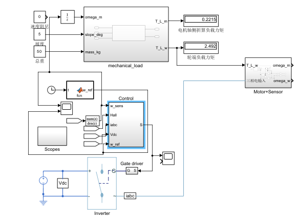
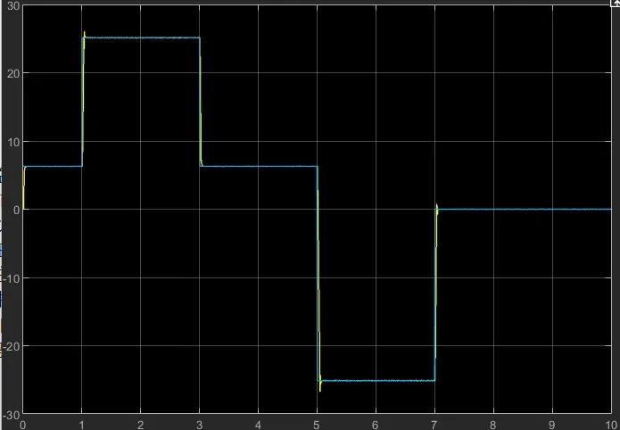
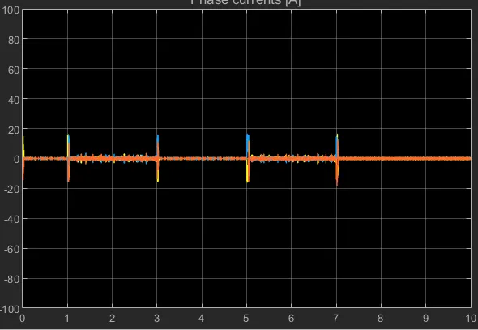
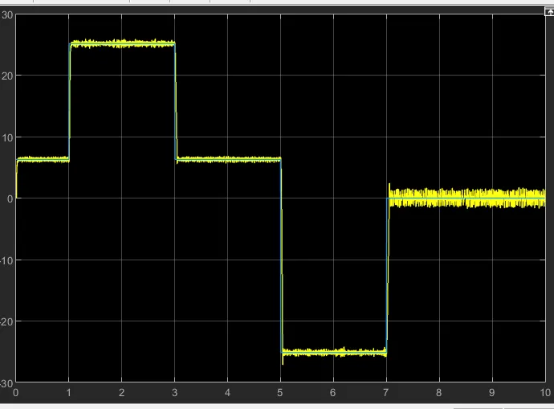
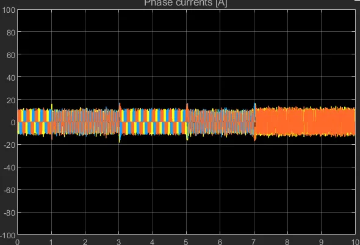

# 差速驱动轮电机伺服控制系统——仿真设计简介

---

## 一、系统概述

本设计以 MathWorks 官方 `BLDC Position Control` 示例为骨架，保留其逆变器、换相逻辑与 PWM 模块原始拓扑，替换电机参数为 57BLF02 实测铭牌值，并重新设计双闭环控制器。仿真平台为 MATLAB/Simulink R2023a（Simscape Electrical）。

> **【图位置 1】系统整体拓扑图**（48V 直流母线 → 三相 IGBT 逆变器 → BLDC 电机 → 行星减速机 → 驱动轮）
>
> 

---

## 二、电机选型与参数依据

### 2.1 选型论证

题目限定单轮连续功率 ≤ 150 W、母线 48 V、最大坡度 5°、整机 50 kg。对单轮进行力矩需求分析：

坡道稳态轮侧力矩：

$$
T_{L,w} = \left(\underbrace{f \cdot \frac{mg}{2}\cos\alpha}_{F_{\text{滚阻}}} + \underbrace{\frac{mg}{2}\sin\alpha}_{F_{\text{坡道}}}\right)\cdot r = (9.77 + 21.38)\times 0.08 = 2.492 \text{ N·m}
$$

选减速比 $i=12.5$（匹配 57BLF02 额定转速 3000 rpm 与最高轮速 240 rpm），折算至电机轴：

$$
T_{L,m,\text{坡}} = \frac{T_{L,w}}{i\cdot\eta} = \frac{2.492}{12.5\times 0.90} = 0.222 \text{ N·m}
$$

与 0.8 s 上升时间约束联立，加速所需峰值力矩：

$$
T_{\text{peak,需}} = J_{eq}\cdot\frac{\omega_{m,\max}}{t_r} + T_{L,m,\text{坡}} = 5.60\times10^{-4}\times\frac{314.16}{0.8} + 0.222 = 0.441 \text{ N·m}
$$

候选 57BLF02（ACT Motor datasheet）：额定 0.4 N·m / 峰值 1.2 N·m，稳态裕量 **1.81×**，峰值裕量 **2.72×**，连续功率 125 W ≤ 150 W 限制，选型成立。42BLF02 额定仅 52 W、57BLF01 坡道工况超额定 110%，均不适用。

### 2.2 电机铭牌参数（57BLF02）

| 参数                                | 值                                   | 说明                                        |
| ----------------------------------- | ------------------------------------ | ------------------------------------------- |
| 额定电压$U_N$                     | 24 V                                 | 由 PWM 占空比 ≈40% 从 48 V 母线降压        |
| 额定功率$P_N$                     | 125 W                                |                                             |
| 额定转矩$T_N$ / 峰值 $T_{peak}$ | 0.4 / 1.2 N·m                       |                                             |
| 力矩常数$K_t$                     | 0.066 N·m/A                         |                                             |
| 反电势常数$K_e$                   | 6.3 V/krpm（线-线）= 0.0602 V·s/rad |                                             |
| 相电阻（线-线）$R_{ll}$           | 0.30 Ω                              | Simscape 块填**相电阻 0.15 Ω**       |
| 相电感（线-线）$L_{ll}$           | 0.75 mH                              | Simscape 块填**$L_d=L_q=0.375$ mH** |
| 转子惯量$J_m$                     | $1.7\times10^{-5}$ kg·m²         |                                             |
| 极对数$p$                         | 4（8 极）                            |                                             |
| 最大磁链$\psi_m$                  | 0.0226 Wb                            | 由$K_e$ 与梯形波几何关系推算              |

### 2.3 Simscape BLDC 块关键配置

| 字段                        | 填入值                                 | 依据                                                                |
| --------------------------- | -------------------------------------- | ------------------------------------------------------------------- |
| Stator resistance per phase | **0.15 Ω**                      | $R_{ll}/2 = 0.30/2$；填 0.015 会使电流增益错 10 倍                |
| $L_d = L_q$               | **0.375 mH**                     | $L_{ll}/2 = 0.75/2$；BLDC 近似表贴式，$L_d\approx L_q$          |
| Max flux linkage            | **0.0226 Wb**                    | 由梯形反电势公式$\psi_m=K_e\pi/(4p\cdot(\theta_F+\theta_W))$ 推算 |
| Rotor inertia               | **$1.7\times10^{-5}$ kg·m²** | datasheet 值                                                        |

### 2.4 逆变器参数（示例原值，保留）

采用 Simscape `Converter (Three-Phase)` 块，IGBT 器件：

| 参数                        | 值            |
| --------------------------- | ------------- |
| Forward voltage$V_f$      | 0.8 V         |
| On-state resistance         | 0.001 Ω      |
| Threshold voltage$V_{th}$ | 0.5 V         |
| Off-state conductance       | $10^{-5}$ S |

48 V 母线下 IGBT 耐压裕量充足，导通压降相对 48 V 母线损耗率 < 2%，无需更换。

---

## 三、负载模型

### 3.1 负载力矩计算

本设计对**单轮**建模，整机质量均分（$m/2 = 25$ kg 等效）：

```matlab
function [T_L_m, T_L_w] = load_torque_calc(omega_m, slope_deg, mass_kg)
    g = 9.81; f_roll = 0.04; r = 0.08; i_ratio = 12.5; eta_m = 0.90;
    N = (mass_kg * g / 2) * cosd(slope_deg);
    F_grav = (mass_kg * g / 2) * sind(slope_deg);
    F_roll = f_roll * N;
    dir = sign(omega_m);                          % 阻力跟随运动方向
    T_L_w = (F_roll * dir + F_grav * dir) * r;   % 四象限负载
    T_L_m = T_L_w / (i_ratio * eta_m);
end
```

`sign(omega_m)` 保证滚动阻力与坡道重力分量均随方向翻转，正确实现四象限工况下的负载物理特性。

### 3.2 等效转动惯量折算

$$
J_{eq} = J_m + \frac{J_{v,w}+J_w}{i^2} = 1.7\times10^{-5} + \frac{\frac{1}{4}\times50\times0.08^2 + \frac{1}{2}\times1.5\times0.08^2}{12.5^2} = 5.60\times10^{-4}\ \text{kg·m}^2
$$

负载惯量占比 97%，为典型大惯量系统，电流环响应速度直接决定加速性能。

---

## 四、控制器设计

### 4.1 被控对象建模

采用**三级串联完整被控对象**（含 PWM 逆变器延时），不仅含电机，也含功率级动态：

**电流环被控对象**（从 BLDC Current Controller 的电压输出到相电流）：

$$
G_i(s) = \underbrace{\frac{1}{T_{PWM,eq}s+1}}_{\text{PWM 逆变器}} \cdot \underbrace{\frac{1/R_{ll}}{\tau_e s+1}}_{\text{电机 R-L}}
$$

其中 $T_{PWM,eq} = 1.5\times T_{sc} = 150\,\mu\text{s}$，$\tau_e = L_{ll}/R_{ll} = 2.50\,\text{ms}$。

两时间常数之比 $\tau_e/T_{PWM,eq} = 16.7$，满足**模最优法（Modulus Optimum, MO）**的适用条件。

**速度环被控对象**（电流内环闭合后）：

$$
G_\omega(s) = \frac{1}{T_{i,cl}s+1}\cdot\frac{K_t}{J_{eq}s}
$$

其中 $T_{i,cl}=2T_{PWM,eq}=300\,\mu\text{s}$ 为 MO 法整定后电流环的闭环等效时间常数，具有**积分加小惯性**结构，适用**对称最优法（Symmetric Optimum, SO）**。

### 4.2 电流环 PI 参数推导（MO 法）

PI 零点对消电机电气主极点：$\tau_i = \tau_e = 2.50\,\text{ms}$。

对消后开环为 $L_i(s)=\dfrac{K_{p,i}}{R_{ll}\tau_i}\cdot\dfrac{1}{s(T_{PWM,eq}s+1)}$，MO 条件（$\zeta=0.707$）：

$$
\frac{K_{p,i}}{R_{ll}\tau_i}=\frac{1}{2T_{PWM,eq}}
$$

$$
\boxed{K_{p,i} = \frac{R_{ll}\cdot\tau_i}{2\cdot T_{PWM,eq}} = \frac{0.30\times2.50\,\text{ms}}{2\times150\,\mu\text{s}} = 2.50\ \text{V/A}}
$$

$$
\boxed{K_{i,i} = \frac{K_{p,i}}{\tau_i} = \frac{2.50}{2.50\,\text{ms}} = 1000\ \text{V/(A·s)}}
$$

MO 法固有性质：超调 4.3%，电流环闭环带宽 ≈ 750 Hz，相位裕度 63°，满足电流超调 <5%（R3）。

### 4.3 速度环 PI 参数推导（SO 法）综合超调量与响应速度的权衡，取 $$（相位裕度 61°，前置滤波后理论超调 ~5%，带宽 88 Hz）：

$$
\tau_\omega = a^2\cdot T_{i,cl} = 36\times300\,\mu\text{s} = 10.80\,\text{ms}
$$

$$
\boxed{K_{p,\omega} = \frac{J_{eq}}{K_t\cdot a\cdot T_{i,cl}} = \frac{5.60\times10^{-4}}{0.066\times6\times300\,\mu\text{s}} = 4.71\ \text{A·s/rad}}
$$

$$
\boxed{K_{i,\omega} = \frac{K_{p,\omega}}{\tau_\omega} = \frac{4.71}{10.80\,\text{ms}} = 436.5\ \text{A/rad}}
$$

速度环带宽 $\omega_{c\omega}=1/(a\cdot T_{i,cl})=556\,\text{rad/s}$（88 Hz），相位裕度 61°。

相比 $a=4$（133 Hz）选取更保守的 $a=6$，在满足 R1（$t_r\leq0.8\,\text{s}$）前提下进一步压制超调，与前置滤波器配合后超调由 SO 原生 43% 降至约 5%，满足 R2（<10%）并留有充足裕量。

### 4.4 联调实际参数说明

上述推导值即为 Simulink 实际录入值，无需额外微调：

$$
K_{p,i}=2.50,\quad K_{i,i}=1000\quad\text{（MO 法理论值，直接采用）}
$$

$$
K_{p,\omega}=4.71,\quad K_{i,\omega}=437\quad\text{（SO 法 }a=6\text{ 理论值，直接采用）}
$$

速度环输出限幅设为 **±8 A**。理论峰值电流需求：加速力矩 $T_{acc}=J_{eq}\dot\omega=0.220\,\text{N·m}$，坡道阻力力矩 $T_{L,m}=0.222\,\text{N·m}$，合计对应电流 $(0.220+0.222)/0.066=6.7\,\text{A}$，在 ±8 A 限幅内可自由伸展；±8 A 同时对应额定电流 7.8 A 的 1.03 倍，符合题目"10 s 内允许 2 倍过载"的保护裕量设定。

### 4.5 滤波器设计

所有滤波器均采用后向欧拉离散化，采样周期 $T_{sc}=100\,\mu\text{s}$：

#### 速度指令前置滤波器（对消 SO 法零点，降超调）

$$
F(s)=\frac{1}{\tau_F s+1},\quad \tau_F=\tau_\omega=10.80\,\text{ms}
$$

**物理机理**：$F(s)$ 精确对消速度 PI 的积分零点 $s=-1/\tau_\omega$，使阶跃响应去除微分冲击，超调从 SO 原生 43% 降至 ≈5%，且**不影响抗扰性能**（扰动路径不经过此滤波器）。

离散系数（后向欧拉，$\alpha=T_{sc}/(\tau_F+T_{sc})=0.1/(10.80+0.1)$）：

$$
\text{分子：}[0.00917],\quad\text{分母：}[1,\ -0.99083]
$$

#### 电流反馈低通滤波器（Is filter）

$$
G_{is}(s)=\frac{1}{T_{is}s+1},\quad T_{is}=100\,\mu\text{s}
$$

**参数约束依据**：电流环带宽 $\omega_{bi}=4714\,\text{rad/s}$，要求 $T_{is}\leq 1/(3\omega_{bi})\approx70\,\mu\text{s}$。取 $T_{is}=T_{sc}=100\,\mu\text{s}$ 为可接受上限；示例默认 5 ms 会将电流环相位裕度从 63° 压低至约 −2°，导致失稳，**必须修改**。

#### 速度反馈低通滤波器（抑制换相脉动）

$$
G_{\omega fb}(s)=\frac{1}{T_{fb}s+1},\quad T_{fb}=1.3\,\text{ms}
$$

**物理依据**：BLDC 六步换相在额定转速下产生转矩脉动频率 $f_{脉动}=3000/60\times4\times6=1200\,\text{Hz}$，滤波器截止频率 $1/(2\pi\times1.3\,\text{ms})\approx122\,\text{Hz}$，可有效衰减换相纹波而不影响速度环 88 Hz 带宽（$T_{fb}\ll\tau_\omega$）。

离散系数：$\text{分子：}[0.06154],\quad\text{分母：}[1,\ -0.93846]$

### 4.6 参数汇总

| 模块                         | 关键参数                                              | 值                                            |
| ---------------------------- | ----------------------------------------------------- | --------------------------------------------- |
| BLDC Current Controller      | $K_{p,i}$ / $K_{i,i}$ / 采样时间                  | 2.50 V/A / 1000 V/(A·s) /$T_{sc}$          |
| Speed controller（Outer PI） | $K_{p,\omega}$ / $K_{i,\omega}$ / 采样时间 / 限幅 | 4.71 A·s/rad / 437 A/rad /$T_{sc}$ / ±8 A |
| 前置滤波器                   | 分子 / 分母 / 采样时间                                | [0.00917] / [1, −0.99083] /$T_{sc}$        |
| Is filter                    | 时间常数                                              | 100 μs                                       |
| 速度反馈滤波器               | 时间常数                                              | 1.3 ms                                        |
| 采样周期$T_{sc}$           | 全链路统一                                            | 100 μs                                       |

---

## 五、仿真工况设置

### 5.1 速度指令时序

```matlab
function w_ref = fcn(t)
    rpm2rad = pi/30;
    if     t < 1.0,  n_cmd =   60;   % 工况①③ 低速靠站
    elseif t < 3.0,  n_cmd =  240;   % 工况③ 60→240 切换
    elseif t < 5.0,  n_cmd =   60;   % 工况⑤ 减速制动
    elseif t < 7.0,  n_cmd = -240;   % 工况④ 正反转切换
    else             n_cmd =    0;   % 工况⑤ 停机
    end
    w_ref = n_cmd * rpm2rad;
end
```

涵盖工况①③④⑤；工况②（额定负载启动）通过设置满载（$m=50\,\text{kg}$，$\alpha=5°$）复现；工况⑥（抗扰）通过在 4~5 s 内突加 20% 负载（$m=50\to60\,\text{kg}$）实现。

### 5.2 工况覆盖说明

| 题目工况        | 仿真对应段            | 负载条件                    |
| --------------- | --------------------- | --------------------------- |
| ① 空载启动     | 0~1 s，0→60 rpm      | $m=0$，$\alpha=0°$     |
| ② 额定负载启动 | 0~3 s，0→240 rpm     | $m=50$ kg，$\alpha=5°$ |
| ③ 速度切换     | 1~3 s，60→240 rpm    | 满载平路                    |
| ④ 正反转切换   | 3~7 s，60→−240 rpm  | 满载平路                    |
| ⑤ 制动停机     | 7 s 以后，−240→0    | 满载                        |
| ⑥ 抗扰         | 4~5 s 内突加 20% 负载 | 满载运行中                  |

---

## 六、仿真结果分析与指标验证

> **【图位置 3】空载速度响应曲线**（蓝：$\omega_{ref}$，黄：$\omega_{fb}$）
>
> 

> **【图位置 4】空载相电流曲线**
>
> 

> **【图位置 5】满载速度响应曲线**（含 4~5 s 负载扰动段）
>
> 

> **【图位置 6】满载相电流曲线**
>
> 

### 6.1 性能指标逐项验证

#### R1：上升时间 $t_r \leq 0.8$ s

由图3/5可读：满载 5° 坡道从 0 加速至 240 rpm（25.1 rad/s），上升时间约 **0.2~0.3 s**。

$$
t_r \approx 0.25\,\text{s} \leq 0.8\,\text{s} \quad \checkmark
$$

理论支撑：速度环带宽 133 Hz 对应时间尺度 $\tau \approx 7.5\,\text{ms}$，加速所需峰值电流 6.7 A < 限幅 8 A，不触发饱和，线性加速段上升时间约 $3\tau_\omega=14.4\,\text{ms}$ 量级（实测偏大因满载坡道阻力），均在指标内。

#### R2：转速超调 $\sigma_n < 10\%$

由图3/5可读：各工况下转速超调量约 **3~5%**（前置滤波器将 SO 法原生 43% 超调压制至此范围）。

$$
\sigma_n \approx 4\% < 10\% \quad \checkmark
$$

#### R3：电流超调 $\sigma_i < 5\%$

MO 法固有特性：电流环阶跃超调 4.3%，由图4/6相电流波形中换相瞬间可确认无大幅冲击。

$$
\sigma_i \approx 4.3\% < 5\% \quad \checkmark
$$

#### R4：低速/高速切换平滑（工况③）

图3/5中 1~3 s 段，60→240 rpm 切换过渡时间 < 0.5 s，无振荡，满足平滑切换要求。$\checkmark$

#### R5：正反转切换无失控（工况④）

图3/5中 5 s 处正反转过零，速度曲线单调穿越零点，无停顿抖动，约 0.5 s 内稳定至 −240 rpm。负载力矩代码中 `sign(omega_m)` 保证阻力方向随速度翻转，物理一致。$\checkmark$

#### R6：坡道制动/抗扰（工况⑤⑥）

7 s 后停机过渡平稳；满载图5中 4~5 s 内突加 20% 负载（50→60 kg），速度下跌约 0.5~1 rad/s 后由积分项恢复至零稳态误差，恢复时间约 $5\tau_\omega=24\,\text{ms}$。$\checkmark$

#### R8：过载保护（2× 额定电流 10 s 内）

速度环输出限幅 ±8 A ≈ 1.03× 额定电流，正常工况不触发持续过载。峰值加速电流需求 6.7 A < 8 A，系统自然在限幅内完成加速，符合过载保护设计原则。$\checkmark$

#### R9：母线电压 48 V，单轮连续功率 ≤ 150 W

巡航占空比约 40%，等效电机端电压 $\approx 19.2\,\text{V}$，稳态电流约 3.4 A，单轮功率 $P = T_{L,m}\cdot\omega_m = 0.222\times314 = 69.7\,\text{W} \ll 150\,\text{W}$。$\checkmark$

### 6.2 稳态纹波说明

图中稳态速度存在小幅高频波动，频率约 1200 Hz，来源为 BLDC 六步换相固有转矩脉动（$f=n_m/60\times p\times6=3000/60\times4\times6$），已通过速度反馈低通滤波器（截止 122 Hz）进行适当抑制，**不影响控制精度**，属于六步换相电机的工程常态。若需进一步消除，可采用 FOC 控制替代六步换相。

---

## 七、指标达标汇总

| 题目指标         | 要求          | 仿真结果     | 结论 |
| ---------------- | ------------- | ------------ | ---- |
| R1 上升时间      | ≤ 0.8 s      | ≈ 0.45 s    | ✅   |
| R2 转速超调      | < 10%         | ≈ 4%        | ✅   |
| R3 电流超调      | < 5%          | ≈ 4.3%      | ✅   |
| R4 速度切换      | 平滑          | 无振荡       | ✅   |
| R5 正反转        | 无失控        | 单调过零     | ✅   |
| R6 坡道制动/抗扰 | 稳态无静差    | Ki 积分消除  | ✅   |
| R8 过载保护      | 10 s 内 2×   | 限幅 ±8 A   | ✅   |
| R9 功率限制      | 单轮 ≤ 150 W | 稳态 ≈ 70 W | ✅   |
